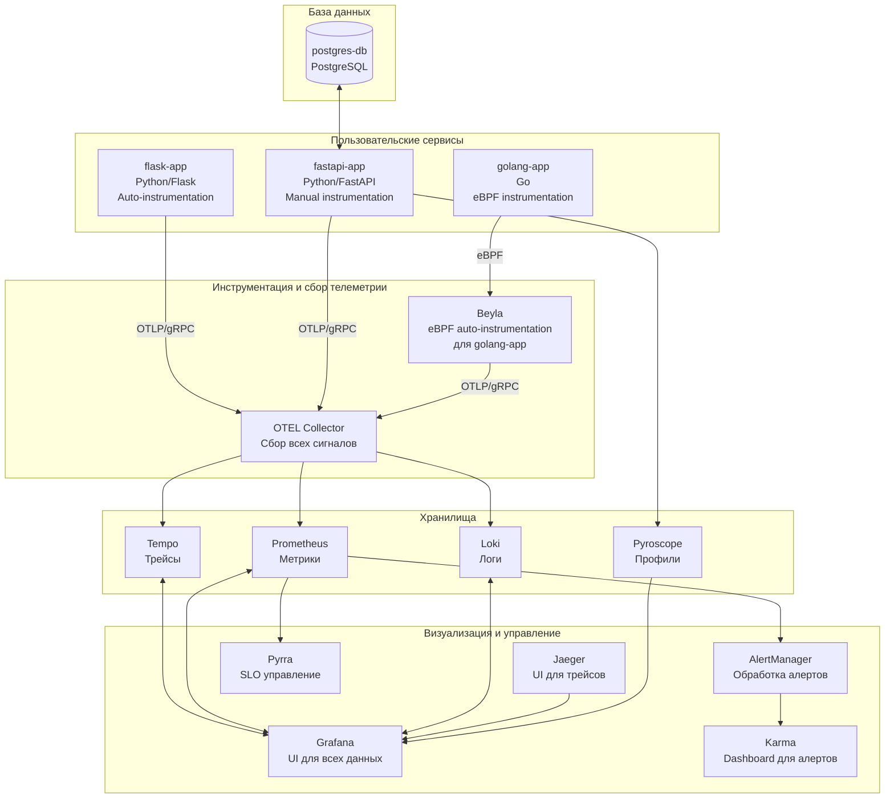
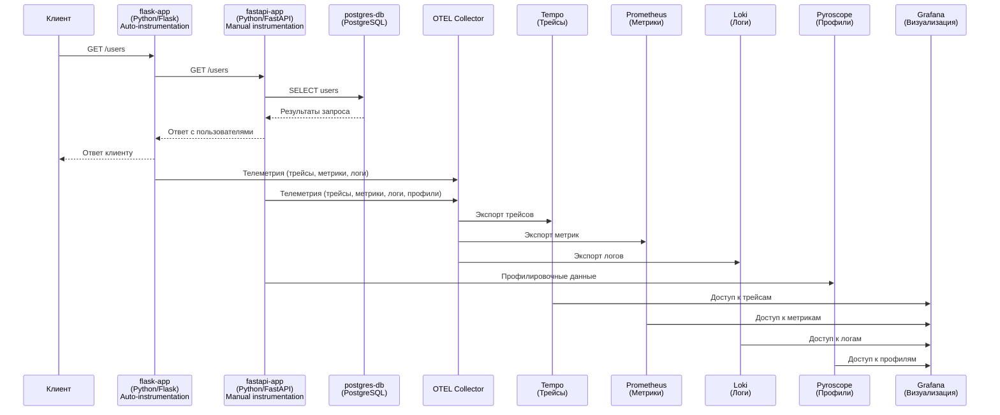

# monitoring-microservices-demo

## Описание проекта

Проект представляет собой демонстрационную среду для работы с распределенной трассировкой, метриками и логами в архитектуре микросервисов с использованием OpenTelemetry и стека Grafana. Среда включает несколько микросервисов на Python и Go с различными подходами к инструментации, а также полный набор инструментов мониторинга и визуализации для анализа производительности и отладки распределенных систем.

## Архитектура системы

### Общая архитектура

## Основные компоненты инфраструктуры

### Сервисы мониторинга и трассировки

- **Grafana** (http://localhost:3000) - платформа визуализации и мониторинга с открытым исходным кодом. Позволяет создавать настраиваемые дашборды для получения аналитики в реальном времени из различных источников данных, включая метрики, логи и трейсы. Объединяет метрики, логи и трейсы в едином интерфейсе для упрощенного мониторинга и устранения неполадок.

- **Jaeger** (http://localhost:16686) - распределенная система трассировки с открытым исходным кодом, разработанная Uber Technologies. Предназначена для мониторинга и устранения неполадок транзакций в сложных архитектурах микросервисов. Позволяет отслеживать запросы по мере их прохождения через несколько сервисов, анализировать производительность и выявлять источники сбоев.

- **Prometheus** (http://localhost:9090) - инструмент мониторинга и оповещения с открытым исходным кодом, предназначенный для надежности и масштабируемости. Использует модель временных рядов для хранения метрик, поддерживает мощный язык запросов PromQL и собирает метрики путем периодического извлечения данных из инструментированных целей.

- **Tempo** - масштабируемый бэкенд распределенной трассировки с открытым исходным кодом от Grafana Labs. Разработан для минимальных операционных накладных расходов и экономичности. Использует объектное хранилище в качестве основного хранилища, что обеспечивает доступное и масштабируемое долгосрочное хранение трассировок.

- **Loki** - горизонтально масштабируемая система агрегации логов с высокой доступностью и поддержкой нескольких арендаторов. Вдохновлена Prometheus, но индексирует только метаданные (метки), а не полный текст строк журнала, что значительно снижает требования к хранению.

- **Pyroscope** (http://localhost:3000/a/grafana-pyroscope-app) - платформа непрерывного профилирования, которая помогает находить проблемы с производительностью в приложениях. Позволяет визуализировать, где процессор тратит время, и отслеживать использование ресурсов по функциям и строкам кода.

### OpenTelemetry

- **OTEL Collector** - сервис с открытым исходным кодом, обеспечивающий унифицированный способ приема, обработки и экспорта телеметрических данных (трассировок, метрик и журналов). Устраняет необходимость запуска нескольких агентов/коллекторов, обеспечивает масштабируемость и поддержку различных форматов данных наблюдаемости.

- **Beyla** - инструмент автоматической инструментации на основе eBPF, который позволяет собирать телеметрические данные из приложений без изменения их кода. Работает на уровне ядра операционной системы для перехвата сетевых вызовов и метрик производительности приложений.

### Алертинг и SLO

- **Pyrra** (http://localhost:9099) - инструмент управления SLO (Service Level Objectives) с открытым исходным кодом, предназначенный для упрощения работы с SLO на основе метрик Prometheus. Автоматически генерирует алерты о сжигании бюджета ошибок и предоставляет визуализацию бюджета ошибок и коэффициентов сжигания.

- **AlertManager** (http://localhost:9093) - компонент экосистемы Prometheus, предназначенный для обработки оповещений, отправленных клиентскими приложениями. Его основные функции включают дедупликацию, группировку и маршрутизацию оповещений к правильным интеграциям получателей, а также управление отключениями и подавлением оповещений.

- **Karma** (http://localhost:8081) - дашборд для Alertmanager, который агрегирует оповещения из нескольких экземпляров Alertmanager, удаляет дубликаты и предоставляет расширенный пользовательский интерфейс для мониторинга и управления оповещениями.

- **Webhook Tester** (http://localhost:8080) - инструмент для тестирования и отладки вебхуков и HTTP-запросов. Позволяет генерировать уникальные URL для захвата входящих запросов и предоставляет различные параметры настройки для обработки ответов.

### Нагрузочное тестирование

- **k6** - инструмент нагрузочного тестирования с открытым исходным кодом, ориентированный на разработчиков. Позволяет тестировать производительность и надежность приложений с минимальным потреблением ресурсов. Поддерживает HTTP/2, WebSockets, gRPC и другие протоколы.

### Пользовательские сервисы

- **fastapi-app** (http://localhost:8000) - сервис на Python с использованием фреймворка FastAPI и **ручной инструментацией** OpenTelemetry.

- **flask-app** (http://localhost:8001) - сервис на Python с использованием фреймворка Flask и **автоматической инструментацией** OpenTelemetry.

- **golang-app** (http://localhost:8002) - сервис на языке Go, **автоматически инструментированный через Beyla** (eBPF).

### Базы данных

- **postgres-db** (localhost:5432) - реляционная система управления базами данных PostgreSQL.

## Команды

- Запуск: `docker-compose up -d`
- Запуск с генераторами: `docker compose -f docker-compose.yaml -f docker-compose.generators.yaml up -d`
- Остановка: `docker-compose down -v`

## Сценарии использования

### Сценарий 1: Запрос к сервисам Flask и FastAPI

Этот сценарий демонстрирует работу распределенных трассировок в Python с использованием как автоматической инструментации (приложение на Flask), так и ручной инструментации с добавлением OpenTelemetry-кода (приложение на FastAPI).

#### Описание взаимодействия сервисов:

#### Подробное описание сервисов:

1. **flask-app** (http://localhost:8001) - edge-сервис, в котором телеметрия подключена посредством автоматической инструментации. Сам сервис написан на Python с использованием Flask без подключения OpenTelemetry-библиотек в коде. При получении запроса на endpoint `/users` сервис выполняет HTTP-запрос к сервису fastapi-app.

2. **fastapi-app** (http://localhost:8000) - сервис с ручной инструментацией OpenTelemetry. Написан на Python с использованием FastAPI. При обработке запроса на endpoint `/users` сервис выполняет запрос к базе данных PostgreSQL для получения списка пользователей. В коде реализована инструментация для сбора трейсов, метрик, логов и профилировочных данных.

3. **postgres-db** (localhost:5432) - реляционная база данных PostgreSQL, содержащая таблицу пользователей. При обращении к ней сервисом fastapi-app выполняется SQL-запрос для получения данных.

#### Поток данных:

1. Клиент отправляет HTTP-запрос `curl http://127.0.0.1:8001/users` к сервису flask-app
2. Сервис flask-app, используя автоматическую инструментацию OpenTelemetry, создает трейс для входящего запроса
3. flask-app отправляет HTTP-запрос к сервису fastapi-app на endpoint `/users`
4. Сервис fastapi-app, используя ручную инструментацию OpenTelemetry, продолжает трейс, начатый в flask-app
5. fastapi-app выполняет SQL-запрос к базе данных postgres-db для получения списка пользователей
6. После получения данных из БД сервис fastapi-app формирует ответ и отправляет его сервису flask-app
7. Сервис flask-app возвращает ответ клиенту

#### Сбор и обработка телеметрии:

- Оба сервиса (flask-app и fastapi-app) собирают телеметрические данные (трейсы, метрики, логи) и отправляют их в OTEL Collector
- Сервис fastapi-app дополнительно отправляет профилировочные данные в Pyroscope
- OTEL Collector экспортирует данные в соответствующие хранилища:
  - Трейсы → Tempo
  - Метрики → Prometheus
  - Логи → Loki
- Все хранилища интегрированы с Grafana для визуализации данных

#### Просмотр результатов:

1. Открыть [Grafana](http://localhost:3000/explore), выбрать `Tempo`, переключиться в тип запроса `Search` и нажать `Run query`
2. Открыть [Jaeger UI](http://localhost:16686/), выбрать сервис внутри `Services` и нажать `Find Traces`
3. В результатах поиска можно увидеть распределенный трейс, охватывающий оба сервиса (flask-app и fastapi-app) и запрос к базе данных
