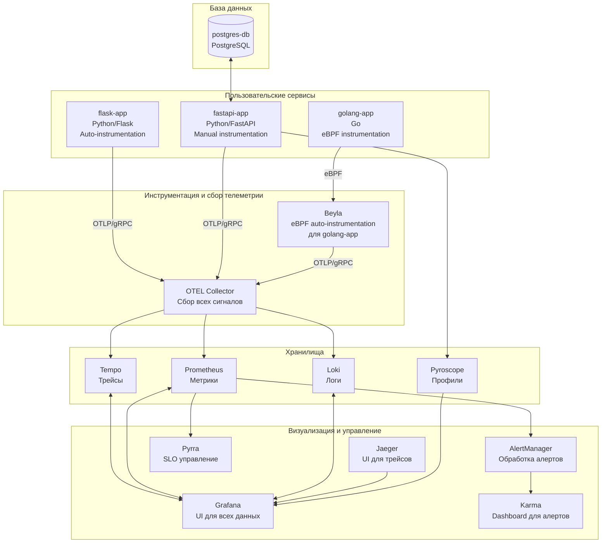
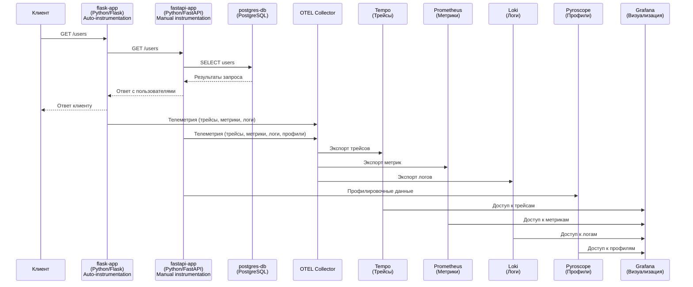
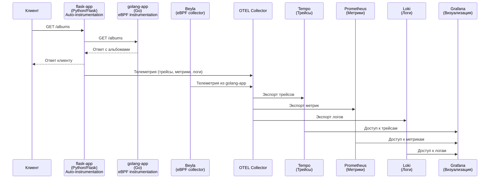

# monitoring-microservices-demo

## Описание проекта

Проект представляет собой демонстрационную среду для работы с распределенной трассировкой, метриками и логами в архитектуре микросервисов с использованием OpenTelemetry и стека Grafana. Среда включает несколько микросервисов на Python и Go с различными подходами к инструментации, а также полный набор инструментов мониторинга и визуализации для анализа производительности и отладки распределенных систем.

## Архитектура системы

### Общая архитектура



## Основные компоненты инфраструктуры

### Сервисы мониторинга и трассировки

- **Grafana** (http://localhost:3000) - платформа визуализации и мониторинга с открытым исходным кодом. Позволяет создавать настраиваемые дашборды для получения аналитики в реальном времени из различных источников данных, включая метрики, логи и трейсы. Объединяет метрики, логи и трейсы в едином интерфейсе для упрощенного мониторинга и устранения неполадок.

- **Jaeger** (http://localhost:16686) - распределенная система трассировки с открытым исходным кодом, разработанная Uber Technologies. Предназначена для мониторинга и устранения неполадок транзакций в сложных архитектурах микросервисов. Позволяет отслеживать запросы по мере их прохождения через несколько сервисов, анализировать производительность и выявлять источники сбоев.

- **Prometheus** (http://localhost:9090) - инструмент мониторинга и оповещения с открытым исходным кодом, предназначенный для надежности и масштабируемости. Использует модель временных рядов для хранения метрик, поддерживает мощный язык запросов PromQL и собирает метрики путем периодического извлечения данных из инструментированных целей.

- **Tempo** - масштабируемый бэкенд распределенной трассировки с открытым исходным кодом от Grafana Labs. Разработан для минимальных операционных накладных расходов и экономичности. Использует объектное хранилище в качестве основного хранилища, что обеспечивает доступное и масштабируемое долгосрочное хранение трассировок.

- **Loki** - горизонтально масштабируемая система агрегации логов с высокой доступностью и поддержкой нескольких арендаторов. Вдохновлена Prometheus, но индексирует только метаданные (метки), а не полный текст строк журнала, что значительно снижает требования к хранению.

- **Pyroscope** (http://localhost:3000/a/grafana-pyroscope-app) - платформа непрерывного профилирования, которая помогает находить проблемы с производительностью в приложениях. Позволяет визуализировать, где процессор тратит время, и отслеживать использование ресурсов по функциям и строкам кода.

### OpenTelemetry

- **OTEL Collector** - сервис с открытым исходным кодом, обеспечивающий унифицированный способ приема, обработки и экспорта телеметрических данных (трассировок, метрик и журналов). Устраняет необходимость запуска нескольких агентов/коллекторов, обеспечивает масштабируемость и поддержку различных форматов данных наблюдаемости.

- **Beyla** - инструмент автоматической инструментации на основе eBPF, который позволяет собирать телеметрические данные из приложений без изменения их кода. Работает на уровне ядра операционной системы для перехвата сетевых вызовов и метрик производительности приложений.

### Алертинг и SLO

- **Pyrra** (http://localhost:9099) - инструмент управления SLO (Service Level Objectives) с открытым исходным кодом, предназначенный для упрощения работы с SLO на основе метрик Prometheus. Автоматически генерирует алерты о сжигании бюджета ошибок и предоставляет визуализацию бюджета ошибок и коэффициентов сжигания.

- **AlertManager** (http://localhost:9093) - компонент экосистемы Prometheus, предназначенный для обработки оповещений, отправленных клиентскими приложениями. Его основные функции включают дедупликацию, группировку и маршрутизацию оповещений к правильным интеграциям получателей, а также управление отключениями и подавлением оповещений.

- **Karma** (http://localhost:8081) - дашборд для Alertmanager, который агрегирует оповещения из нескольких экземпляров Alertmanager, удаляет дубликаты и предоставляет расширенный пользовательский интерфейс для мониторинга и управления оповещениями.

- **Webhook Tester** (http://localhost:8080) - инструмент для тестирования и отладки вебхуков и HTTP-запросов. Позволяет генерировать уникальные URL для захвата входящих запросов и предоставляет различные параметры настройки для обработки ответов.

### Нагрузочное тестирование

- **k6** - инструмент нагрузочного тестирования с открытым исходным кодом, ориентированный на разработчиков. Позволяет тестировать производительность и надежность приложений с минимальным потреблением ресурсов. Поддерживает HTTP/2, WebSockets, gRPC и другие протоколы.

### Пользовательские сервисы

- **fastapi-app** (http://localhost:8000) - сервис на Python с использованием фреймворка FastAPI и **ручной инструментацией** OpenTelemetry.

- **flask-app** (http://localhost:8001) - сервис на Python с использованием фреймворка Flask и **автоматической инструментацией** OpenTelemetry.

- **golang-app** (http://localhost:8002) - сервис на языке Go, **автоматически инструментированный через Beyla** (eBPF).

### Базы данных

- **postgres-db** (localhost:5432) - реляционная система управления базами данных PostgreSQL.

## Команды

- Запуск: `docker-compose up -d`
- Запуск с генераторами: `docker compose -f docker-compose.yaml -f docker-compose.generators.yaml up -d`
- Остановка: `docker-compose down -v`

## Дашбоарды в Grafana

В системе предусмотрены специализированные dashboards в Grafana для мониторинга различных аспектов работы сервисов:

### 1. FastAPI Dashboard

Dashboard для мониторинга сервиса fastapi-app, включающий следующие метрики:
- Общее количество успешных и ошибочных запросов в минуту
- Распределение запросов по статус кодам (2xx, 4xx, 5xx)
- Процент успешных запросов (2xx) и ошибок (5xx) по endpoint'ам
- Средняя продолжительность запросов с разбивкой по обработчикам
- Квантили времени отклика (p50, p90)
- Процент запросов с временем отклика менее 100ms

### 2. FastAPI Observability

Расширенный dashboard для наблюдаемости за сервисом fastapi-app, содержащий:
- Общее количество запросов за последние 24 часа
- Количество запросов по методам и endpoint'ам
- Средняя продолжительность запросов по обработчикам
- Процент успешных и ошибочных запросов
- 99-й перцентиль времени отклика запросов
- Частота запросов в секунду

### 3. Pyrra - List

Dashboard для отображения списка всех Service Level Objectives (SLO):
- Название каждого SLO
- Целевое значение SLO (объектив)
- Временное окно измерения
- Текущая доступность сервиса
- Оставшийся бюджет ошибок (error budget)

### 4. Pyrra - Detail

Детальный dashboard для анализа конкретного SLO, включающий:
- Целевое значение SLO и временное окно
- Текущая доступность сервиса
- Оставшийся бюджет ошибок в процентах
- График изменения бюджета ошибок во времени
- Частота запросов (rate) и количество ошибок (errors)

## Сценарии использования

### Сценарий 1: Запрос к сервисам Flask и FastAPI

Этот сценарий демонстрирует работу распределенных трассировок в Python с использованием как автоматической инструментации (приложение на Flask), так и ручной инструментации с добавлением OpenTelemetry-кода (приложение на FastAPI).

#### Описание взаимодействия сервисов:



#### Подробное описание сервисов:

1. **flask-app** (http://localhost:8001) - edge-сервис, в котором телеметрия подключена посредством автоматической инструментации. Сам сервис написан на Python с использованием Flask без подключения OpenTelemetry-библиотек в коде. При получении запроса на endpoint `/users` сервис выполняет HTTP-запрос к сервису fastapi-app.

2. **fastapi-app** (http://localhost:8000) - сервис с ручной инструментацией OpenTelemetry. Написан на Python с использованием FastAPI. При обработке запроса на endpoint `/users` сервис выполняет запрос к базе данных PostgreSQL для получения списка пользователей. В коде реализована инструментация для сбора трейсов, метрик, логов и профилировочных данных.

3. **postgres-db** (localhost:5432) - реляционная база данных PostgreSQL, содержащая таблицу пользователей. При обращении к ней сервисом fastapi-app выполняется SQL-запрос для получения данных.

#### Поток данных:

1. Клиент отправляет HTTP-запрос `curl http://127.0.0.1:8001/users` к сервису flask-app
2. Сервис flask-app, используя автоматическую инструментацию OpenTelemetry, создает трейс для входящего запроса
3. flask-app отправляет HTTP-запрос к сервису fastapi-app на endpoint `/users`
4. Сервис fastapi-app, используя ручную инструментацию OpenTelemetry, продолжает трейс, начатый в flask-app
5. fastapi-app выполняет SQL-запрос к базе данных postgres-db для получения списка пользователей
6. После получения данных из БД сервис fastapi-app формирует ответ и отправляет его сервису flask-app
7. Сервис flask-app возвращает ответ клиенту

#### Сбор и обработка телеметрии:

- Оба сервиса (flask-app и fastapi-app) собирают телеметрические данные (трейсы, метрики, логи) и отправляют их в OTEL Collector
- Сервис fastapi-app дополнительно отправляет профилировочные данные в Pyroscope
- OTEL Collector экспортирует данные в соответствующие хранилища:
  - Трейсы → Tempo
  - Метрики → Prometheus
  - Логи → Loki
- Все хранилища интегрированы с Grafana для визуализации данных

#### Просмотр результатов:

1. Открыть [Grafana](http://localhost:3000/explore), выбрать `Tempo`, переключиться в тип запроса `Search` и нажать `Run query`
2. Открыть [Jaeger UI](http://localhost:16686/), выбрать сервис внутри `Services` и нажать `Find Traces`
3. В результатах поиска можно увидеть распределенный трейс, охватывающий оба сервиса (flask-app и fastapi-app) и запрос к базе данных

### Сценарий 2: Запрос к сервисам Flask и Golang

Этот сценарий демонстрирует сбор распределенных трассировок с двух взаимодействующих сервисов без каких-либо манипуляций с их кодом. Телеметрия собирается посредством автоматической инструментации: через внешние библиотеки для сервиса `flask-app` и через eBPF для сервиса `golang-app`.

#### Описание взаимодействия сервисов:



#### Подробное описание сервисов:

1. **flask-app** (http://localhost:8001) - edge-сервис, в котором телеметрия подключена посредством автоматической инструментации OpenTelemetry. Сам сервис написан на Python с использованием Flask без подключения OpenTelemetry-библиотек в коде. При получении запроса на endpoint `/albums` сервис выполняет HTTP-запрос к сервису golang-app.

2. **golang-app** (http://localhost:8002) - простой сервис на языке Go без подключения OpenTelemetry-библиотек в коде. Сервис предоставляет endpoint `/albums`, который возвращает статический список музыкальных альбомов в формате JSON. Автоматическая инструментация осуществляется через Beyla с использованием технологии eBPF, которая перехватывает сетевые вызовы на уровне ядра операционной системы.

3. **Beyla** - инструмент автоматической инструментации на основе eBPF, который собирает телеметрические данные из приложения golang-app без изменения его кода. Работает на уровне ядра операционной системы для перехвата сетевых вызовов и метрик производительности приложения.

#### Поток данных:

1. Клиент отправляет HTTP-запрос `curl http://127.0.0.1:8001/albums` к сервису flask-app
2. Сервис flask-app, используя автоматическую инструментацию OpenTelemetry, создает трейс для входящего запроса
3. flask-app отправляет HTTP-запрос к сервису golang-app на endpoint `/albums`
4. Сервис golang-app возвращает статический список альбомов в формате JSON
5. Сервис flask-app возвращает ответ клиенту

#### Сбор и обработка телеметрии:

- Сервис flask-app собирает телеметрические данные (трейсы, метрики, логи) с помощью автоматической инструментации OpenTelemetry и отправляет их в OTEL Collector
- Сервис golang-app не содержит кода инструментации, но его телеметрия собирается Beyla с использованием технологии eBPF
- Beyla перехватывает сетевые вызовы сервиса golang-app и отправляет телеметрические данные в OTEL Collector
- OTEL Collector экспортирует данные в соответствующие хранилища:
  - Трейсы → Tempo
  - Метрики → Prometheus
  - Логи → Loki
- Все хранилища интегрированы с Grafana для визуализации данных

#### Просмотр результатов:

1. Открыть [Grafana](http://localhost:3000/explore), выбрать `Tempo`, переключиться в тип запроса `Search` и нажать `Run query`
2. Открыть [Jaeger UI](http://localhost:16686/), выбрать сервис внутри `Services` и нажать `Find Traces`
3. В результатах поиска можно увидеть распределенный трейс, охватывающий оба сервиса (flask-app и golang-app)

### Сценарий 3: Нагрузочное тестирование с помощью k6

Этот сценарий демонстрирует выполнение нагрузочного тестирования системы с помощью инструмента k6. В процессе тестирования генерируется множество запросов к сервису flask-app, что позволяет оценить производительность системы под нагрузкой и проанализировать SLO (Service Level Objectives).

#### Описание нагрузочного тестирования:

```javascript
import http from 'k6/http';
import { check, sleep } from 'k6';

export const options = {
  vus: 10,        // 10 виртуальных пользователей
  duration: '15m', // Длительность теста 15 минут
};

export default function () {
  // Выполнение HTTP-запроса к endpoint /users сервиса flask-app
  const res = http.get('http://localhost:8001/users');
  // Проверка, что ответ имеет статус 200
  check(res, { 'status was 200': (r) => r.status == 200 });
  // Пауза 0.5 секунды между запросами
  sleep(0.5);
}
```

#### Подробное описание сценария:

1. **k6** - инструмент нагрузочного тестирования с открытым исходным кодом, ориентированный на разработчиков. Позволяет тестировать производительность и надежность приложений с минимальным потреблением ресурсов.

2. **Параметры тестирования**:
   - **vus**: 10 виртуальных пользователей, одновременно выполняющих запросы
   - **duration**: 15 минут - общая длительность теста
   - **endpoint**: `http://localhost:8001/users` - целевой endpoint сервиса flask-app
   - **частота запросов**: один запрос каждые 0.5 секунды от каждого виртуального пользователя

3. **Поток данных**:
   - k6 создает 10 виртуальных пользователей, каждый из которых выполняет циклические запросы к сервису flask-app
   - Сервис flask-app, получая запросы, перенаправляет их сервису fastapi-app на endpoint `/users`
   - Сервис fastapi-app выполняет запрос к базе данных PostgreSQL для получения списка пользователей
   - Результаты возвращаются по цепочке: fastapi-app → flask-app → k6

#### Сбор и обработка телеметрии при нагрузочном тестировании:

- Во время выполнения нагрузочного теста все компоненты системы продолжают собирать телеметрические данные:
  - Трейсы собираются системами Tempo и Jaeger
  - Метрики собираются Prometheus и используются для расчета SLO
  - Логи собираются Loki
  - Профилировочные данные собираются Pyroscope

- Собранные данные позволяют анализировать:
  - Производительность системы под нагрузкой
  - Соблюдение SLO (Service Level Objectives)
  - Влияние нагрузки на задержки и доступность сервисов

#### Просмотр результатов нагрузочного тестирования:

1. Открыть [Pyrra](http://localhost:9099/) для просмотра индикаторов SLO:
   - Доступность сервиса
   - Задержки обработки запросов (latency)
   - Количество ошибок

2. Открыть [Grafana](http://localhost:3000/) для просмотра графиков изменения показателей:
   - Графики изменения latency
   - Графики доступности сервиса
   - Графики использования ресурсов

3. Открыть [Jaeger UI](http://localhost:16686/) для анализа трассировок, полученных во время нагрузочного тестирования

#### Команды для выполнения нагрузочного тестирования:

```bash
# Запуск нагрузочного тестирования через k6
k6 run k6-script.js
```

## Полезные ссылки

- https://sre.google/books/ - must-have SRE Books
- https://blog.alexewerlof.com/p/slc - инструмент для работы с SLI/SLO
- https://manassharma.hashnode.dev/opentelemetry-logs-deep-dive - хорошая обзорная статья про построение мониторинга на основе связанных сигналов телеметрии на базе OpenTelemtry & OpenObserve
- https://levelup.gitconnected.com/monitoring-fastapi-with-grafana-prometheus-a-5-minute-guide-658280c7f358 - гайд с примерами настройки мониторинга FastAPI с Grafana + Prometheus
- https://mkaz.me/blog/2024/slo-formulas-implementation-in-promql-step-by-step/ - статья про расчет SLO на основе Prometheus метрик для веб-сервиса
- https://grafana.com/oss/pyroscope/ - использование профилировщика для задач мониторинга
- https://github.com/opensearch-project/opentelemetry-demo - проект для демонстрации возможности простроена системы мониторинга на базе opensearch

## Материалы с докладов
