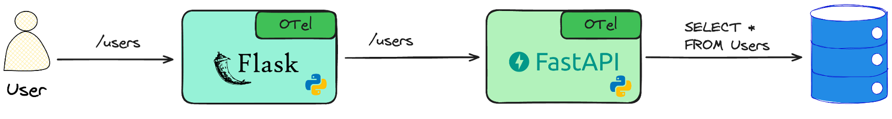

# Python Demo Apps with OpenTelemetry Traces, Logs and Metrics

Набор различных способов добавления OpenTelemetry-библиотек (инструментация) в приложения написанные на Python с использованием фреймворков Flask, FastAPI

Набор готовых настроек в виде Docker-контейнеров для быстрого запуска сервисов для работы с метриками, логами и трейсами:
- [`Grafana`](http://localhost:3000/) - UI для работы с трейсами, логами и метриками
- [`Jaeger UI`](http://localhost:16686/) - UI и хранилище для трейсов
- [`Prometheus`](http://localhost:9090/) - хранилище метрик
- `OpenTelemetry Collector` - сбор и обработка OpenTelemetry-данных
- `Loki` - хранилище логов
- `Tempo` - хранилище трейсов
- `Beyla` - приложение для автоинструментации приложений с помощью eBPF
- [`Pyrra`](http://localhost:9099/) - процессинг и UI для работы с SLO, бюджетом ошибок и другими индикаторами
- [`Karma`](http://localhost:8081/) - UI для работы с алертами
- [`AlertManager`](http://localhost:9093/) - процессинг и UI для алертов
- [`Webhook Tester`](http://localhost:8080/#/00000000-0000-0000-0000-000000000000) - UI для просмотра отправляемых от AlertManager событий
- [`Pyroscope`](http://localhost:3000/a/grafana-pyroscope-app) - просмотр профилировочной информации

## Описание архитектуры

### Описание архитектуры пользовательских сервисов

TODO

### Описание архитектуры инфраструктуры для мониторинга

TODO

## Запуск сервисов

Запустить сервисы
```
docker-compose up -d
```

Запустить сервисы и дополнительно генераторы трейсов
```
docker compose -f docker-compose.yaml -f docker-compose.generators.yaml -d
```
> Используемые контейнеры с генераторами трейсов
> - Контейнер [grafana/xk6-client-tracing](https://github.com/grafana/xk6-client-tracing) - это расширение для k6, предназначенное для генерации и отправки трейсов с целью нагрузочного тестирования.
> - Контейнер **telemetrygen** из проекта [open-telemetry/opentelemetry-collector-contrib](https://github.com/open-telemetry/opentelemetry-collector-contrib) предназначен также для симуляции и тестирования конвейеров OpenTelemetry Collector, отправляя трейсы через протокол OTLP на указанный endpoint.

## Описание сценариев

### 1. Запрос сервисам Flask и FastAPI

Пример работы работы распределенных трассировок в Python как с использованием автоинструментации (приложение на Flask), так и без нее, с добавлением opentelemtry-кода (приложение на FastAPI).

Описание цепочки  между двумя сервисами:


Описание сервисов:
- `flask-app` - edge-сервис, в котором телеметрия подключена посредством автоинструментации. Сам сервис написан на Python с Flask без подключения opentelemtry-библиотек
- `fastapi-app` - сервис, с добавлением в коде вызовов opentelemtry-библиотек.  Написан на Python с FastAPI. Имеется подключение к БД и запрос данных из нее.

Выполнить запрос к `flask-app`:
```
curl http://127.0.0.1:8001/users
```

Найти запрос в UI:
- Открыть [`Grafana`](http://localhost:3000/explore), выбрать `Tempo`, переключиться в тип запроса `Search` и нажать `Run query`:
  
- Открыть [`Jaeger UI`](http://localhost:16686/), выбрать сервис внутри `Services` и нажать `Find Traces`:
  

Открыть трейс запроса и получить всю информацию по спанам:
- Grafana:
  
- Jaeger UI:
  


### 2. Запрос сервисам Flask и Golang

Пример сбора распределенных трассировок с двух взаимодействующих сервисов без каких-либо манипуляций с их кодом. С обоих сервисов собирается телеметрия посредством автоинструментации: через внешние библиотеки (сервис `flask-app`) и через ebpf (сервис `golang`)

Описание цепочки  между двумя сервисами:
TODO

Описание сервисов:
- `flask-app` - сервис, из предыдущего примера, без подключения opentelemtry-библиотек
- `golang-app` - простой сервис на Golang, без подключения opentelemtry-библиотек

Выполнить запрос к `flask-app`:
```
curl http://127.0.0.1:8001/albums
```

Найти запрос в UI:
- Открыть [`Grafana`](http://localhost:3000/explore), выбрать `Tempo`, переключиться в тип запроса `Search` и нажать `Run query`.
- Открыть [`Jaeger UI`](http://localhost:16686/), выбрать сервис внутри `Services` и нажать `Find Traces`.
- Открыть трейс запроса и получить всю информацию по спанам.


### 3. Запуск нагрузочного сценария

Запуск множества запросов на `/users` через [k6](https://k6.io/):
```sh
k6 run k6-script.js
```

Просмотр индикатров SLO в [Pyrra](http://localhost:9099/):


Просмотр изменения значения индикатров SLO в [Pyrra](http://localhost:9099/) (например Latency - `95% успешных запросов должны быть обработаны быстрее, чем за 1с`):


Просмотр графиков изменения показателей используемых в расчете SLO в [Pyrra](http://localhost:9099/):


Просмотр графиков изменения показателей используемых в расчете SLO в [Pyrra](http://localhost:9099/):


## Остановка сервисов

Остановить все сервисы
```
docker-compose down -v
```

# Полезные ссылки

- https://sre.google/books/ - must-have SRE Books
- https://blog.alexewerlof.com/p/slc - инструмент для работы с SLI/SLO
- https://manassharma.hashnode.dev/opentelemetry-logs-deep-dive - хорошая обзорная статья про построение мониторинга на основе связанных сигналов телеметрии на базе OpenTelemtry & OpenObserve
- https://levelup.gitconnected.com/monitoring-fastapi-with-grafana-prometheus-a-5-minute-guide-658280c7f358 - гайд с примерами настройки мониторинга FastAPI с Grafana + Prometheus
- https://mkaz.me/blog/2024/slo-formulas-implementation-in-promql-step-by-step/ - статья про расчет SLO на основе Prometheus метрик для веб-сервиса
- https://grafana.com/oss/pyroscope/ - использование профилировщика для задач мониторинга