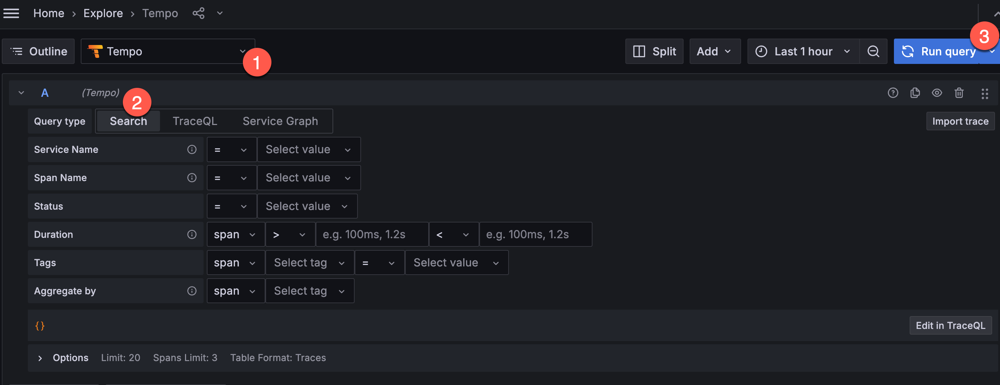
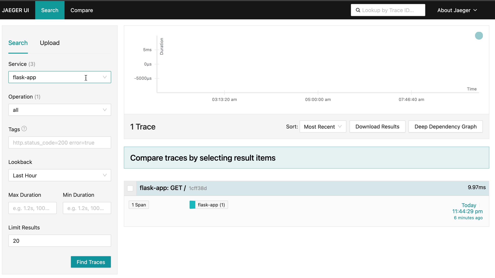
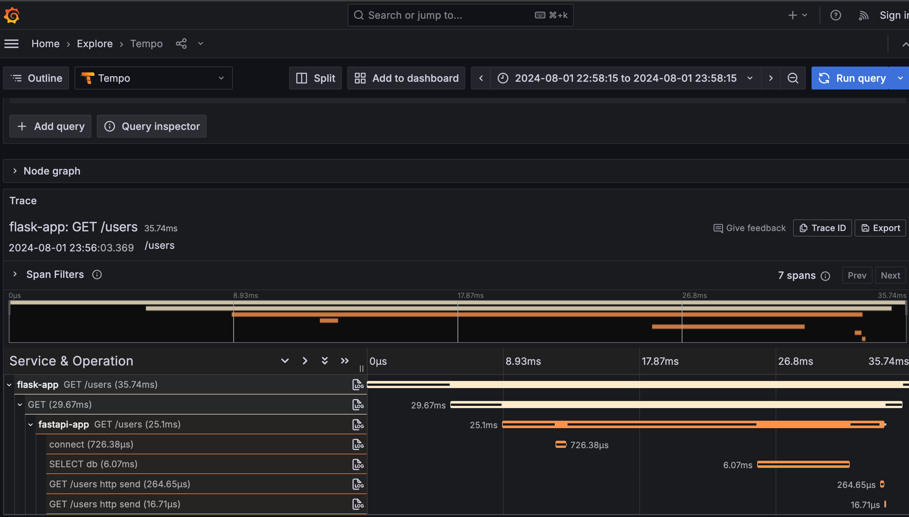
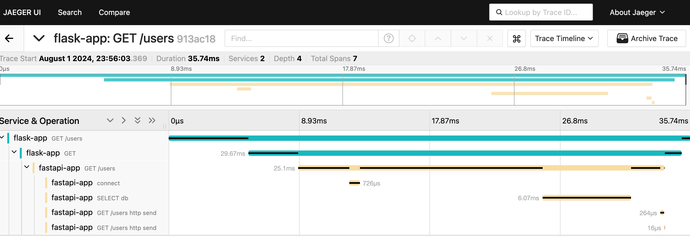
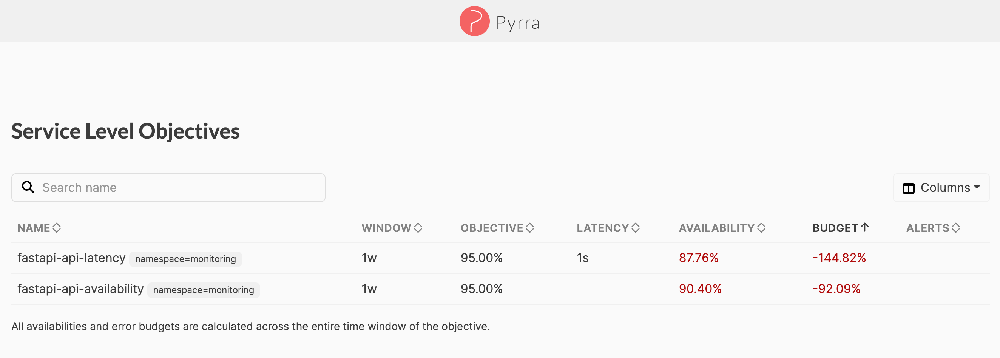
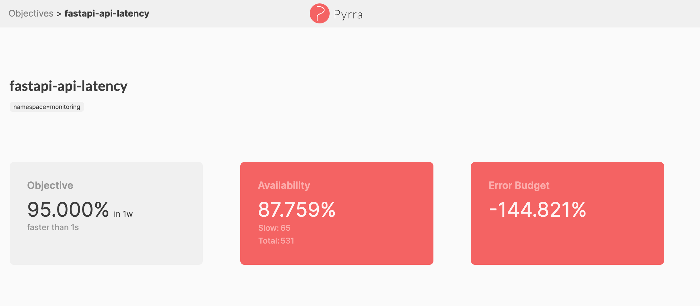
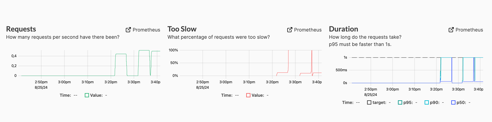
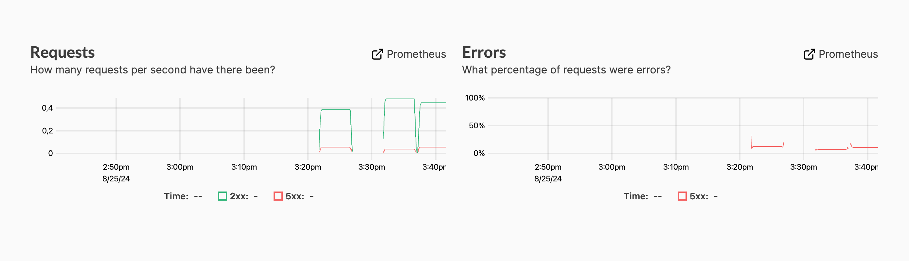

# Python Demo Apps with OpenTelemetry Traces, Logs and Metrics

Набор различных способов добавления OpenTelemetry-библиотек (инструментация) в приложения написанные на Python с использованием фреймворков Flask, FastAPI

Набор готовых настроек в виде Docker-контейнеров для быстрого запуска сервисов для работы с метриками, логами и трейсами:
- [`Grafana`](http://localhost:3000/) - UI для работы с трейсами, логами и метриками
- [`Jaeger UI`](http://localhost:16686/) - UI и хранилище для трейсов
- [`Prometheus`](http://localhost:9090/) - хранилище метрик
- `OpenTelemetry Collector` - сбор и обработка OpenTelemetry-данных
- `Loki` - хранилище логов
- `Tempo` - хранилище трейсов
- [`Pyrra`](http://localhost:9099/) - процессинг и UI для работы с SLO, бюджетом ошибок и другими индикаторами
- [`Karma`](http://localhost:8081/) - UI для работы с алертами
- [`AlertManager`](http://localhost:9093/) - процессинг и UI для алертов
- [`Webhook Tester`](http://localhost:8080/#/00000000-0000-0000-0000-000000000000) - UI для просмотра отправляемых от AlertManager событий

## Описание архитектуры

### Описание архитектуры пользовательских сервисов

TODO

### Описание архитектуры инфраструктуры для мониторинга

TODO

## Быстрый старт

Запустить все сервисы
```
docker-compose up -d
```

Выполнить запрос к edge-сервису (`flask-app`):
```
curl http://127.0.0.1:8001/users
```

Найти запрос в UI:
- Открыть [`Grafana`](http://localhost:3000/explore), выбрать `Tempo`, переключиться в тип запроса `Search` и нажать `Run query`:
  
- Открыть [`Jaeger UI`](http://localhost:16686/), выбрать сервис внутри `Services` и нажать `Find Traces`:
  

Открыть трейс запроса и получить всю информацию по спанам:
- Grafana:
  
- Jaeger UI:
  

Остановить сервисы
```
docker-compose down -v
```

## Запуск тестового сценария

Запуск множества запросов на /users через k6:
```sh
k6 run k6-script.js
```

Просмотр индикатров SLO в [Pyrra](http://localhost:9099/):


Просмотр изменения значения индикатров SLO в [Pyrra](http://localhost:9099/) (например Latency - `95% успешных запросов должны быть обработаны быстрее, чем за 1с`):


Просмотр графиков изменения показателей используемых в расчете SLO в [Pyrra](http://localhost:9099/):


Просмотр графиков изменения показателей используемых в расчете SLO в [Pyrra](http://localhost:9099/):


